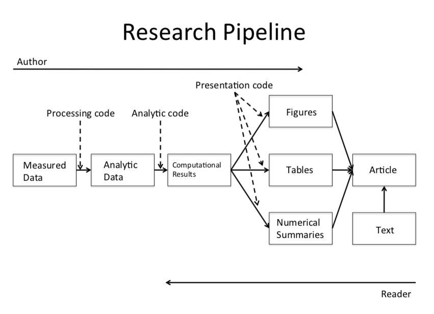
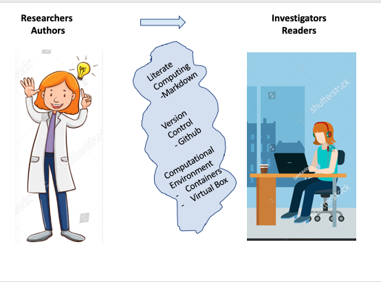
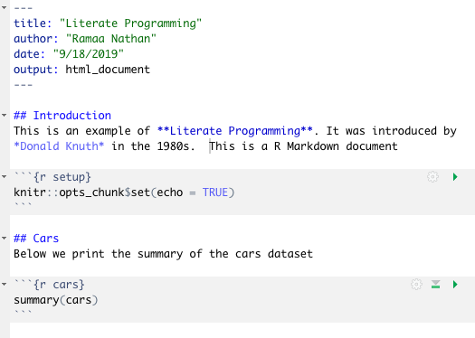
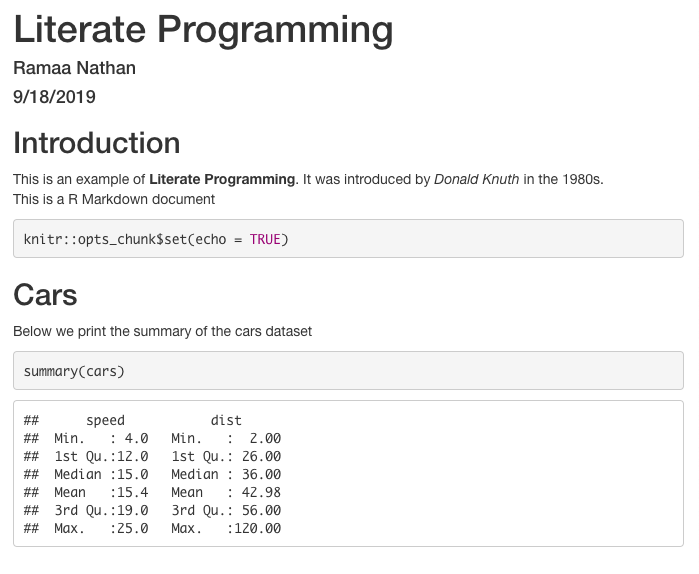
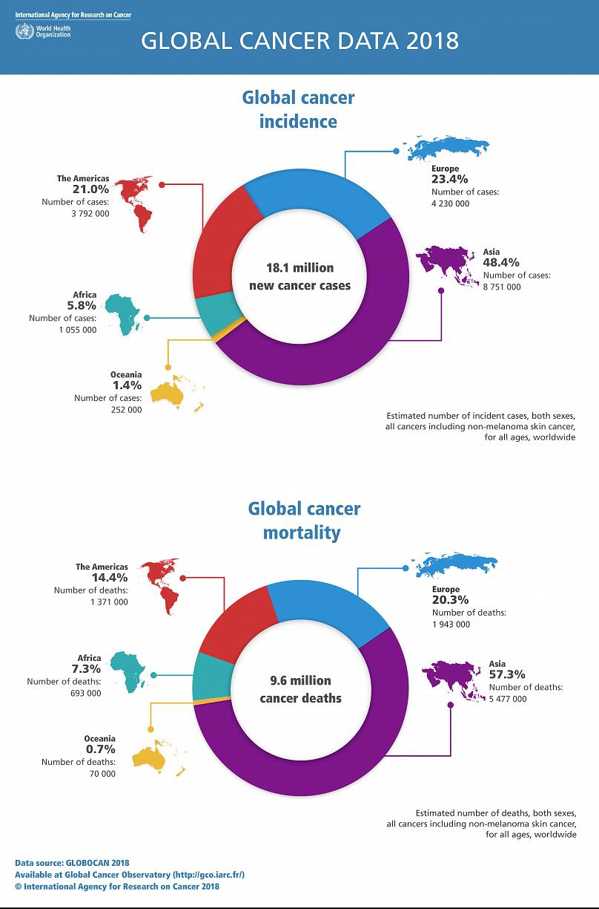
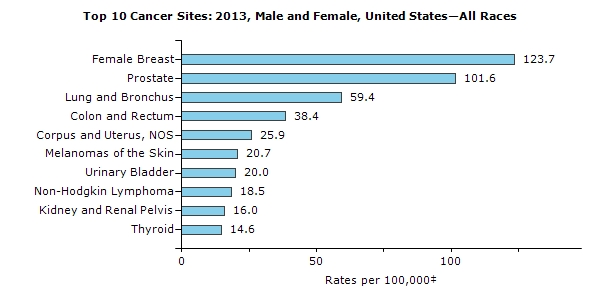
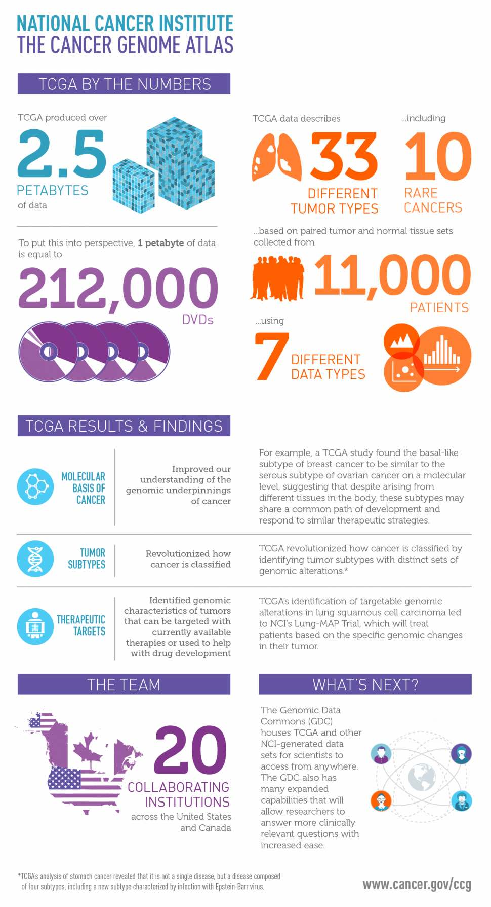
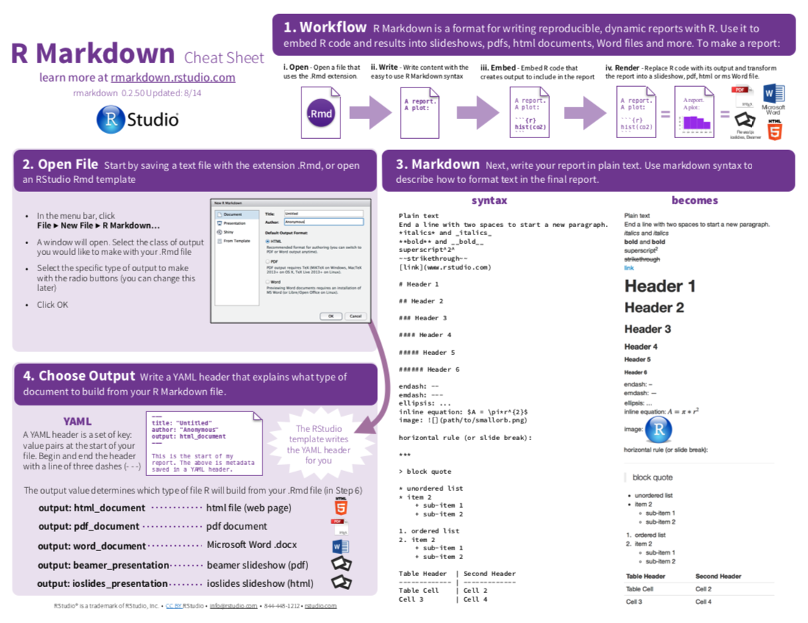
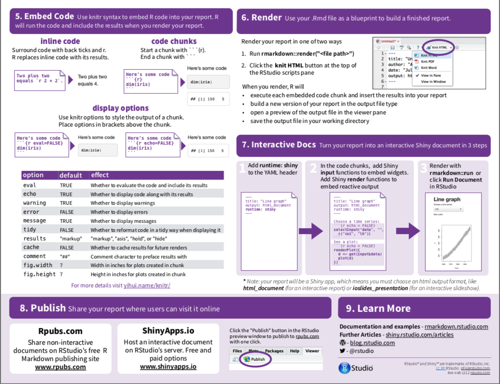

## About me

:::::::::::::: {.columns}
::: {.column}
- I am a fellow data enthusiast 
- Worked in different roles in the financial and healthcare industry
- Newly minted statistician
- Looking for a new position as a statistician or data scientist
- Free time - Run and Teach healthy Indian Vegetarian cooking
- Co-organize Data Philly Meetup events
:::
::: {.column}

:::
::::::::::::::

::: notes
worked in different roles as a quant developer, data analyst, quantitative researcher, project manager.
Got very interested in doing core data science and so decided to study statistics.
:::


## Outline

- **Reproducible Research**
  - Concepts 
  - Literate Programming
  - R Markdown
- Case Study: Survival Analysis
- Generating Different Types of Documents using R Markdown

## Reproducible Research

- Important for research and scientific claims to be reproduced and validated by independent investigators
- Importance for reproducibility highlighted by the scandal in 2006 
    - Cancer research scientists at Duke University falsified data 
    - Research could not be reproduced by scientists at MD Anderson
- Reproducible Research Standards proposed by Victoria Stodden in 2009

::: notes
For several centuries, scientists and researchers have been making great scientific innovations. Whenever possible, these findings have been tested and validated by others. It was relatively easy earlier. But is becoming harder withe the advances in technologies, methodologies, and big data.
Victoria Stodden from Standford University
Details on types of reproducible research on the R OpenScience website
:::

## Reproducible Research

- **Replication:** Independent people going out and collecting new data
- **Reproducibility:** Independent people analysing the same data

### Reproducible Research 
- Make analytic data and code available so that others may reproduce the findings.

::: notes
- Not all research can be reproduced in its entirety - research may be too involved, require a lot of time and funding
- Roger Peng of Johns Hopkins Distinguishes between replication and reproducibility
- Reproduce research for validation or for learning
- In general, rr corresponds to reproducing and validating the Data Analysis component.
:::

## Research Pipeline




## Reproducible Research - What is needed?

- Data (Raw / Processed) with Data Dictionary
- Documented Source Code
- Software Environment

::: notes
To make their research or work reproducible, scientists or authors in general will need to make information on all these publicly available.

For reproducible research, it is best to use open souce software and platforms or release information under a Creative Commmon Attribution (CC-BY) License
:::

## Reproducible Research - Tools Required

 

::: notes
Sharing Research is not as easy as it sounds.
- Authors want to make their research reproducible
- Readers want to reproduce the research

Challenges:
- Authors must take care to explain their analysis in a comprehensive manner such that all information is in one location. Literate Programming like Markdown documents helps with this
- Authors must be able to provide the data in an easily accessible manner. Version Control public repositories like Github help with this
- The readers need to have a similar computational environment to be able to reproduce the results. With the available exhaustive technology, each computational environment  in research institutions or corporations vary vastly. So the resources may not match. In addition, a complete research project may have several dependencies in addition to the data and code. Containers like docker or Amazon ECSmake it very easy to package and deploy the entire software.
:::


## Literate Programming

:::::::::::::: {.columns}
::: {.column}

:::
::: {.column}

:::
::::::::::::::


:::notes
- Programming paradigm introduced by Donald Knuth in the 1980s. Combines programming language  with a document language 
- Natural language like English is interspersed with snippets of source code. Article text explains what is going on without the need to read 
- In general, Markdown is used as the Document Language which is basically a text to HTML converter and is a simplified version of a "markup" language"
- Markdown helps to easily create HTML header or section, itemized and ordered lists, bold and italics formats, and provide links to external links and image
- Examples are 
    - R Markdown which uses Markdown as the document language and R as the programming Language
    - Jupyter with Python which uses Markdown as the document language and Python as the programming Language
:::


##  R Markdown Technology Stack


## Outline

- Reproducible Research 
  - Concepts 
  - Literate Programming
  - R Markdown
- **Case Study: Survival Analysis**
- Generating Different Types of Documents using R Markdown

## What is Survival Analysis?

:::::::::::::: {.columns}
::: {.column}
Branch of statistics used for analyzing the **expected duration of time** until one or more **events** occur
:::
::: {.column}
**Events**  
- Death in biological systems  
- Relapse of cancer   
- Failure in mechanical systems  
- Loan performance in economic systems  
- Time to retirement  
- Time to finding a job  
:::
::::::::::::::


:::notes
The concept of an event is different in different areas of study.  
I have chosen to do survival analysis of breast cancer where the event of interest could be relapse of cancer, death, etc.  
:::

## Cancer Statistics

:::::::::::::: {.columns}
::: {.column}

:::
::: {.column}

:::
::::::::::::::


:::notes
- Cancer is among the leading causes of death worldwide
- as per the Cancer Statistics from the National Cancel Institute.  
- Death due to cancer is over 50% worldwide and around 35% in the united states and so is a major concern.
- On a personal note, right around the time that I was researching for a topic to work on, one of my best friends was diagnosed with breast cancer. So, I decided to study the survival analysis of breast cancer.
:::

## Where do we get the data from?

:::::::::::::: {.columns}
::: {.column}

:::
::: {.column}

:::
::::::::::::::


::: notes
- The Cancer Genome Atlas (TCGA) Program is a joint effort between the National Cancer Institute and the Human Genome Research Institute
- Provides publicly-available clinical and high-throughput genomic data for thirty-three different types of cancers. 
- Data source is widely used by researchers and has led to vast improvements in diagnosing, treating, and preventing cancer. 
:::

## Survival Analysis - Terminologies

- **Variable of interest:** Time to Event
  - Examples include survival time from onset of diagnosis, time until progression from one stage of disease to another, and time from surgery until hospital discharge.
  
- **Statistical Measures of Interest:** 
  - **Survival Function:** Probability of surviving beyond time t
  - **Hazard Rate (Risk of Death)**: Probability that if a person survives to time t, they will experience the event in the next instant.
  - **Cumulative hazard:** Accumulation of hazard rate over time since time of first diagnosis
  - **Hazard Ratio:** Ratio of two hazard functions and is used to compare the risk of death between two treatment groups
 

:::notes
:::

## What is Censoring?


::: notes
- Central to survival analysis is the concept of censoring
- In any clinical study where the variable of interest is time to events all subjects may not experience the event during the period of study. In such cases, the time to event is considered to be censored. 
- There are three types of censoring - left, right, and interval. We consider only right censoring here 
- Right Censoring: Event is not observed because of loss-to-follow-up, death from a cause other than the trial endpoint, study termination, and other reasons unrelated to the endpoint of interest.
:::

## Research Questions

1. What is the median survival time for breast cancer?
2. What are the important factors that influence risk of death for Breast Cancer?
3. What are the effects of each factor on survival of breast cancer?
4. How do all factors together influence the survival time of breast cancer?


```{r setup, include=FALSE}
knitr::opts_chunk$set(echo = FALSE, cache=FALSE)

#The Following libraries need to be installed once.
# Load the bioconductor installer. 
# Try http:// if https:// doesn't work.
#source("https://bioconductor.org/biocLite.R")

# Install the main RTCGA package
#biocLite("RTCGA")

# Install the clinical and mRNA gene expression data packages
#biocLite("RTCGA.clinical")

# Test CRAN package installation:
library(tidyverse)
library(stringr) #for string manipulations
library(forcats) # for factors

library(gridExtra) #for plotting in a grid
library(xtable) 

library(JM)
library(cmprsk)

#load survival libraries
library(survminer)
library(survival)

# Test RTCGA: 
library(RTCGA)
library(RTCGA.clinical)
library(RTCGA.mRNA)

#modeling
library(AICcmodavg)  #to extract AICc
library(parmsurvfit)
library(flexsurv)
library(SurvRegCensCov)

```


## TCGA - Important Variables

```{r origcolumns, echo=FALSE}
clinicalDataCols = tibble(
  ColumnName = c("Gender", "Race", "Ethnicity","Age","Vital Status",
             "Days to Death","Days to Followup"
             ),
  DataType = c("categorical","categorical","categorical","integer","binary","integer",
               "integer"),
  Description = c("Gender", "Race", "Ethnicity", "Age at first diagnosis", "Vital Status (1 - dead (event), 0 - alive/censored)",
                  "Number of days to death from first diagnosis",
                  "Number of days to last follow-up from first diagnosis")
  )
knitr::kable(clinicalDataCols) 
#%>% kable() %>% kable_styling(full_width=F,position="float_left",bootstrap_options=c("bordered")) 

```

::: notes
The TCGA dataset contains 3703 variables from which a few variables containing demographic and cancer stage information are selected as important predictors or independent variables for survival analysis.
:::


## TCGA - Important Variables

```{r origcolumns2, echo=FALSE}

clinicalDataCols2 = tibble(
  ColumnName = c("Therapy type",
             "Pathologic Stage",
             "Pathology T",
             "Pathology N",
             "Pathology M"
             ),
  DataType = c("categorical","categorical","categorical","categorical","categorical"),
  Description = c("Therapy Type (Chemo, Harmone, Immuno, etc.",
                  "Cancer stage - based on T,M, and N labeling",
                  "Tumor (T) stage describing size and location of tumor",
                  "Lymph (N) nodes status describing if cancer has spread into nearby lymph nodes",
                  "Metastasis (M) status describing if cancer has spread to other parts of the body")
  )
knitr::kable(clinicalDataCols2) 
#%>% kable() %>% kable_styling(full_width=F,position="float_left",bootstrap_options=c("bordered")) 


```

::: notes

Data transformations are applied to the raw data
1. Rename the long variable names to short names.
2. Filter out the 12 observations corresponding to males diagnosed with breast cancer.
3. Filter out the 2 observations with negative "times" value.
4. Create a "age" variable that contains the number of days at first diagnosis to age in years at first diagnosis.
5. Create a "years_to_event" variable which is the "times"" variable   converted from days to years.
6. Data in the pathology columns contain information on both stage and sub-stage. Transform the data to only contain the high level stage information.
5. Modify the "therapy_type"" to contain three types - chemotherapy, hormone therapy and Other (lump all the other infrequent types into Other)
6. Modify the "race"" to contain three types - black or african american and white (lump the other two types into Other)
:::

```{r BRCA_extract, echo=FALSE, message=FALSE}
# Create the clinical data
brca_clin_orig <- survivalTCGA(BRCA.clinical, 
                     extract.cols=c("patient.gender", "patient.race",
                                    "patient.ethnicity","patient.days_to_birth","patient.vital_status",
                                    "patient.drugs.drug.therapy_types.therapy_type",
                                    "patient.stage_event.pathologic_stage",
                                   "patient.stage_event.tnm_categories.pathologic_categories.pathologic_t",
                                  "patient.stage_event.tnm_categories.pathologic_categories.pathologic_n",
                                  "patient.stage_event.tnm_categories.pathologic_categories.pathologic_m"))
#sapply(brca_clin_orig,class)
```

```{r BRCA_transform, echo=FALSE, message=FALSE}
#helper Functions
clean_pathologic_stage <- function(x) {
  x %>% str_replace_all(c(
    "stage iv[a-d]*"="stage4",
    "stage [i]{3}[a-d]*"="stage3",
    "stage i{2}[a-d]*"="stage2",
    "stage i{1}[a-d]*"="stage1",
    "stage x"="stageX"))
}

clean_pathologyTstage <- function(x) {
  x %>% str_replace_all(c(
    "\\s*tx"="tx",
    "\\s*t1[a-z]*"="t1", 
    "\\s*t2[a-z]*"="t2",
    "\\s*t3[a-z]*"="t3",
    "\\s*t4[a-z]*"="t4"))
}

clean_pathologyMstage <- function(x) {
  x %>% str_replace_all(c("cm0\\s+\\(i[\\+,-]\\)"="cm0"))
}

clean_pathologyNstage <- function(x) {
  x %>% str_trim(.) %>% 
    str_replace_all(c(
      "nx"="nx", 
      "n1[a-z]*"="n1", 
      "n2[a-z]*"="n2",
      "n3[a-z]*"="n3",
      "n4[a-z]*"="n4",
      "n0"="n0",
      "n0\\s+\\([a-z]*[\\+|-]\\)"="n0"))
}


#transform the data
brca_clin <- brca_clin_orig %>% 
  rename(gender=patient.gender,
         race=patient.race,
         ethnicity=patient.ethnicity,
         vital_status=patient.vital_status,
         therapy_type=patient.drugs.drug.therapy_types.therapy_type,
         pathologic_stage=patient.stage_event.pathologic_stage,
         pathologyTstage=patient.stage_event.tnm_categories.pathologic_categories.pathologic_t,
         pathologyNstage=patient.stage_event.tnm_categories.pathologic_categories.pathologic_n,
         pathologyMstage=patient.stage_event.tnm_categories.pathologic_categories.pathologic_m) %>%
  filter(gender == "female") %>% 
  filter(times > 0) %>%
  mutate(age=abs(as.numeric(patient.days_to_birth))/365,
         therapy_type = ifelse(is.na(therapy_type),"No Info",therapy_type),
         therapy_type = fct_lump(therapy_type,3),
         race = fct_lump(race,2),
         pathologic_stage=str_trim(pathologic_stage),
         pathologyTstage=str_trim(pathologyTstage),
         pathologyNstage=str_trim(pathologyNstage),
         pathologyMstage=str_trim(pathologyMstage),
         pathologic_stage = clean_pathologic_stage(pathologic_stage),
         pathologyTstage = clean_pathologyTstage(pathologyTstage),
         pathologyNstage = clean_pathologyNstage(pathologyNstage),
         pathologyMstage = clean_pathologyMstage(pathologyMstage),
         years_to_event=times/365,
         agecat=cut(age, breaks=c(0, 40, 60, Inf), labels=c("young", "middle", "old"))
         )

#Convert specified columns from character to factor type.
convert_to_factor <- c("ethnicity", "pathologic_stage",
                       "pathologyTstage", "pathologyMstage","pathologyNstage")
brca_clin <- brca_clin %>% mutate_at(convert_to_factor,factor)

#remove unnecessary columns
brca_clin <- brca_clin %>% 
  dplyr::select(-starts_with("patient"))
#names(brca_clin)

#Verify the class types
#sapply(brca_clin,class)

#What are the dimensions of the brca_clin dataset?
#dim(brca_clin)
```

## BRCA - Age at First Diagnosis

```{r, echo=FALSE, message=FALSE}
brca_clin %>% filter(!is.na(age)) %>% 
  ggplot(aes(x=age)) +
    geom_histogram(color="black",fill="white")+
    #geom_density(alpha=0.2,fill="#FF6666") +
    geom_vline(aes(xintercept=mean(age)), color="blue", linetype="dashed", size=1) +
    labs(x="Age at First Diagnosis",y="Count")
    
```

::: notes
We have a  total of 1032 observations. The distribution of age at first diagnosis is mostly symmetric with an average of 59 years, a standard deviation of 13 years and ranging from 29 years to 90 years. 
:::

## BRCA - Time to Event

```{r, echo=FALSE, message=FALSE}
brca_clin %>% filter(!is.na(times)) %>%
  ggplot(aes(x=years_to_event)) +
    geom_histogram(color="black",fill="white") +
    geom_vline(aes(xintercept=mean(years_to_event)), color="blue", linetype="dashed", size=1) +
    labs(x="Time to Event",y="Count")

#brca_clin %>% dplyr::select(age) %>% summary()
```

::: notes
Distribution of years to the event (either censored or death) and without considering censoring is right skewed with an average value of 2.5 years and a standard deviation of 2.8 years. This is not helpful information as censoring information is an important component of survival data. So, we will only consider right censored plots to observe the data.
:::

  
## Survival Function Modeling

   - **Non Parametric Model - Kaplan Meier**
     - Probability of Survival at Time x and  Median Survival Time 
     - Comparison of survival curves for different groups using log-rank or MH statistic
   - **Parametric Models - Exponential and Weibull**
     - Compare Survival Time and Risk of Death between different groups
   - **Semi Parametric Model - Cox Proportional Hazard Model**
     - Determine significant covariates 
     - Compare survival time and risk of death between different groups

::: notes
- To answer our research questions, we need to model the data.
- We will analyze each factor or predictor separately and study its effect on survival time. We will then consider all the predictors together 
- For each predictor, we will apply the three types of models – non-parametric, parametric and semi-parametric,
 Together, they provide all the information required for survival analysis.

- In a non-parametric method like Kaplan Meier survival curve, the survival data is not assumed to follow any specific distribution. Only empirical information from the data is used for modeling

- In the parametric models, the survival data is assumed to follow a specific distribution – like exponential, Weibull, log-logistic, etc. I have only considered the Exponential and Weibull distributions here 

- The Cox Proportional Hazard Regression model is semi-parametric, containing both parametric and non-parametric components. This model also makes no assumptions on the distribution of the survival data and is used to model the hazard or instantaneous risk at time t in the presence of covariates.  The hazard rate is modeled as a linear combination of the covariates like age, race, therapy type, and cancer stages. 
:::


## Overall Survival of BRCA: Kaplan Meier

```{r kaplan_all, echo=FALSE, message=FALSE, warning=FALSE}
# Model the Kaplan Meier Survival Curve
surv_obj <- with(brca_clin, Surv(years_to_event, vital_status))
surv_fit<- survfit(surv_obj ~ 1,data=brca_clin)

#Plot the survival curves for the different groups
 ggsurvplot(surv_fit,
           pval = TRUE,
           conf.int = TRUE,
           conf.int.fill="strata",
           conf.int.alpha=0.2,
           surv.median.line = "hv",
           legend="right",
           title="Survival Curves")
```

:::notes
The Kaplan-Meier survival curve shows the change in probability of survival since time of first diagnosis for a person diagnosed with breast cancer and when none of the predictors are accounted for. 
It can  be seen that the survival time for a person decreases very slowly for the first five years, then decreases almost linearly from five to ten years and stabilizes around 12 years. 
There were a total of 104 events out of the 1032 observations. The overall point estimate of the median survival time is 9.5 years.
:::


## Age 
:::::::::::::: {.columns}
::: {.column}
```{r, echo=FALSE, message=FALSE,fig.cap="Censoring & Event Plot"}
brca_clin_age <- brca_clin %>%
  filter(!is.na(agecat)) %>%
  arrange(agecat) 

brca_clin_age %>%
  mutate(index=1:n()) %>% 
  ggplot(
       aes(xend = 0, 
           y = index, 
           x = years_to_event, #times, 
           yend = index, 
           colour = agecat,
           shape = factor(vital_status))) + 
  geom_segment() + 
  geom_point() +
  ggtitle("Right Censoring in TCGA - BRCA by Age Categories") +
  labs(x="Years to Event", y="Subjects") +
  scale_color_discrete(name = "Age Categories", labels = c("Young: < 40 years", "Middle: 40-60 years", "Old: >60 years")) +
  scale_shape_discrete(name = "Status", labels = c("Censored","Event"))
  
```
:::
::: {.column}
```{r, echo=FALSE, message=FALSE,fig.cap="Kaplan Meier Survival Curve"}
# Model the Kaplan Meier Survival Curve
surv_obj_age <- with(brca_clin_age, Surv(years_to_event, vital_status))
surv_fit_age<- survfit(surv_obj_age ~ agecat,data=brca_clin_age)#times,

#Plot the survival curves for the different groups
ggsurvplot(surv_fit_age,
           pval = TRUE,
           conf.int = TRUE,
           conf.int.fill="strata",
           conf.int.alpha=0.2,
           surv.median.line = "hv",
           legend="right",
           title="Survival Curves by Age Categories")
```
:::
::::::::::::::

::: notes
- The age at first diagnosis is split into 3 groups: young, old and middle  
- Less than 10% of the subjects are less than 40 years old. The number of subjects in the other two groups are almost equally distributed.   
- The survival rate is higher in the young group (92%) than in the old group ( 88%). 
- The median survival time is the highest for the middle age group at 12.21 years and at 9.36 years for the old age group followed by 8.4 years for the young age group.  
- On comparison of the curves using log-rank statistic, the middle and old age groups are found to be significantly different.
- So Age is a significant  predictor
:::

## Race

:::::::::::::: {.columns}
::: {.column}
```{r, echo=FALSE, message=FALSE, fig.cap="Censoring & Event Plot"}
brca_clin_race <- brca_clin %>%
  filter(!is.na(race)) %>%
  arrange(race) 

brca_clin_race %>%
  mutate(index=1:n()) %>% 
  ggplot(
       aes(xend = 0, 
           y = index, 
           x = years_to_event, #times, 
           yend = index, 
           colour = race,
           shape = factor(vital_status))) + 
  geom_segment() + 
  geom_point() +
  ggtitle("Right Censoring in TCGA - BRCA by Race") +
  labs(x="Years to Event", y="Subjects") +
  scale_color_discrete(name = "Race", labels = c("Black or African American", "White", "Other")) + 
  scale_shape_discrete(name = "Status", labels = c("Censored","Event"))
```

:::
::: {.column}
```{r kaplan_race, echo=FALSE, message=FALSE, fig.cap="Kaplan Meier Survival Curve"}
# Model the Kaplan Meier Survival Curve
surv_obj_race <- with(brca_clin_race,Surv(years_to_event, vital_status))
surv_fit_race <- survfit(surv_obj_race ~ race,data=brca_clin_race)#times,

#Plot the survival curves for the different groups
ggsurvplot(surv_fit_race,
           pval = TRUE,
           conf.int = TRUE,
           conf.int.fill="strata",
           conf.int.alpha=0.2,
           surv.median.line = "hv",
           legend="right",
           title="Survival Curves by Race",
           fontsize=2,
           tables.height=0.3,
           tables.col="strata",
           surv.plot.height=1)
```
:::
::::::::::::::


::: notes
- The race information is missing for 10% of the subjects. 76% of the subjects are white, 18% are black and only 6% are of other races. The survival rate is approximately 90% for subjects of both the black and white races.  
- The survival curves for both the races - white and black or African-American are very similar with a median survival time of 9.5 years. The log rank test also indicates that the survival curves are not significantly different. So, race is not a strong predictor of survival rate.
:::


## Ethnicity

:::::::::::::: {.columns}
::: {.column}
```{r, echo=FALSE, message=FALSE,fig.cap="Censoring & Event Plot"}
brca_clin_ethnicity <- brca_clin %>%
  filter(!is.na(ethnicity)) %>%
  arrange(ethnicity)

brca_clin_ethnicity %>%
  mutate(index=1:n()) %>% 
  ggplot(
       aes(xend = 0, 
           y = index, 
           x = years_to_event, #times, 
           yend = index, 
           colour = ethnicity,
           shape = factor(vital_status))) + 
  geom_segment() + 
  geom_point() +
  ggtitle("Right Censoring in TCGA - BRCA by Ethnicity") +
  labs(x="Years to Event", y="Subjects") +
  scale_color_discrete(name = "Ethnicity", labels = c("Hispanic or Latino", "Not Hispanic or Latino")) +
  scale_shape_discrete(name = "Status", labels = c("Censored","Event"))
  

```
:::
::: {.column}
```{r kaplan_ethnicity, echo=FALSE, fig.cap="Kaplan Meier Survival Curves"}
# Model the Kaplan Meier Survival Curve
surv_obj_ethnicity <- with(brca_clin_ethnicity, Surv(years_to_event, vital_status))
surv_fit_ethnicity<- survfit(surv_obj_ethnicity ~ ethnicity,data=brca_clin_ethnicity)#times,

#Plot the survival curves for the different groups
ggsurvplot(surv_fit_ethnicity,
           pval = TRUE,
           conf.int = TRUE,
           conf.int.fill="strata",
           conf.int.alpha=0.2,
           surv.median.line = "hv",
           legend="right",
           title="Survival Curves by Ethnicity",
           fontsize=2,
           tables.height=0.3,
           tables.col="strata",
           surv.plot.height=1)
```

:::
::::::::::::::

::: notes
the number of Hispanic or Latino patients is very small with 96% of the subjects being non-Hispanic or Latino.
:::

## Therapy Type

:::::::::::::: {.columns}
::: {.column}
```{r, echo=FALSE, message=FALSE,fig.cap="Censoring & Event Plot"}
brca_clin_therapy <- brca_clin %>%
  # mutate(therapy_type = ifelse(is.na(therapy_type),"No Info",therapy_type),
  #        therapy_type = fct_lump(therapy_type,3)) %>%
  arrange(therapy_type)

brca_clin_therapy %>%
  mutate(index=1:n()) %>% 
  ggplot(
       aes(xend = 0, 
           y = index, 
           x = years_to_event, #times, 
           yend = index, 
           colour = therapy_type,
           shape = factor(vital_status))) + 
  geom_segment() + 
  geom_point() +
  ggtitle("Right Censoring in TCGA - BRCA by Therapy Type") +
  labs(x="Years to Event", y="Subjects") +
  scale_color_discrete(name = "Therapy Type", 
                       labels = c("Chemotherapy","Hormone Therapy", "No Info", "Other")) +
  scale_shape_discrete(name = "Status", labels = c("Censored","Event")) 
```
:::
::: {.column}
```{r kaplan_therapy, echo=FALSE, fig.cap="Kaplan Meier Survival Curves"}
# Model the Kaplan Meier Survival Curve
surv_obj_therapy <- with(brca_clin_therapy, Surv(years_to_event, vital_status))
surv_fit_therapy<- survfit(surv_obj_therapy~therapy_type,data=brca_clin_therapy)#times,

#Plot the survival curves for the different groups
ggsurvplot(surv_fit_therapy,
           pval = TRUE,
           conf.int = TRUE,
           conf.int.fill="strata",
           conf.int.alpha=0.2,
           surv.median.line = "hv",
           legend="right",
           title="Survival Curves by Therapy Type",
           fontsize=2,
           tables.height=0.3,
           tables.col="strata",
           surv.plot.height=1)
```

:::
::::::::::::::


::: notes
- 45% of the subjects are on chemotherapy, 25% are on hormone therapy, 1% on other therapy. There is no information on therapy for 25% of the subjects.  The group with no information on therapy has the highest event rate at 26%.
- we observe that there is a big difference in survival and hazard rates between the groups of subjects administered some form of treatment and the group with no treatment reported.
- The risk of death for subjects on no treatment is five times higher than subjects administered some form of treatment with the median survival time being less than 7 years
- Therapy Type is a significant predictor
:::


##  Pathological Cancer Stage

:::::::::::::: {.columns}
::: {.column}
```{r, echo=FALSE, message=FALSE,fig.cap="Censoring & Event Plots"}
brca_clin_stage <- brca_clin %>%
  filter (!is.na(pathologic_stage)) %>%
  arrange(pathologic_stage)

brca_clin_stage %>%
  mutate(index=1:n()) %>% 
  ggplot(
       aes(xend = 0, 
           y = index, 
           x = years_to_event, #times, 
           yend = index, 
           colour = pathologic_stage,
           shape = factor(vital_status))) + 
  geom_segment() + 
  geom_point() +
  ggtitle("Right Censoring in TCGA - BRCA by Pathologic (Cancer) Stage") +
  labs(x="Years to Event", y="Subjects") +
    scale_color_discrete(name = "Cancer Stage", 
                         labels = c("Stage1","Stage2","Stage3","Stage4","StageX")) +
    scale_shape_discrete(name = "Status", labels = c("Censored","Event"))


```
:::
::: {.column}
```{r kaplan_stage, echo=FALSE,fig.cap="Kaplan Meier Survival Curves"}
# Model the Kaplan Meier Survival Curve
surv_obj_stage <- with(brca_clin_stage, Surv(years_to_event, vital_status))
surv_fit_stage<- survfit(surv_obj_stage ~ pathologic_stage,data=brca_clin_stage)#times,

ggsurvplot(surv_fit_stage,
           pval = TRUE,
           conf.int = TRUE,
           conf.int.fill="strata",
           conf.int.alpha=0.2,
           surv.median.line = "hv",
           legend="right",
           title="Survival Curves by Cancer Stage",
           fontsize=2,
           tables.height=0.3,
           tables.col="strata",
           surv.plot.height=1)
```
:::
::::::::::::::


:::notes
- Approximately 50% of the subjects are diagnosed with stage 2 cancer, while less than 2% of the subjects are either in stage 4 or in stage X. The percentage of events is the highest (almost 50%) for the stage 4 and stage X groups and the lowest (7%)  for stage 1
- we observe that the hazard rate steadily increases with increase in the diagnosed cancer stage number. Correspondingly, the median survival time steadily reduces from 10.8 years for stage 1 to 3.7 years for stage 4.
- Next when we compare the survival curves in pairs, we find that only survival curves for stage1 and stage2 are not significantly different
- The survival curves are found to be significantly different
- When compared with stage 1 group, the survival time reduces
By 16% for stage 2,
By 45% for stage 3
By 70% for stage 4

Pathological Cancer stage is a significant predictor

:::


## Tumor (T) Stage: 

:::::::::::::: {.columns}
::: {.column}
```{r, echo=FALSE, message=FALSE, fig.cap="Censoring & Event Plots"}
brca_clin_Tstage <- brca_clin %>%
  filter (!is.na(pathologyTstage)) %>%
  arrange(pathologyTstage)

brca_clin_Tstage %>%
  arrange(pathologyTstage) %>%
  mutate(index=1:n()) %>% 
  ggplot(
       aes(xend = 0, 
           y = index, 
           x = years_to_event, #times, 
           yend = index, 
           colour = pathologyTstage,
           shape = factor(vital_status))) + 
  geom_segment() + 
  geom_point() +
  ggtitle("Right Censoring in TCGA - BRCA by Tumor (T) stage") +
  labs(x="Years to Event", y="Subjects") +
  scale_color_discrete(name = "Tumor Stage", labels = c("t1","t2","t3","t4","tx")) +
  scale_shape_discrete(name = "Status", labels = c("Censored","Event")) 

```

:::
::: {.column}
```{r kaplan_Tstage, echo=FALSE, fig.cap="Kaplan Meier Survival Curves "}
# Model the Kaplan Meier Survival Curve
surv_obj_Tstage <- with(brca_clin_Tstage, Surv(years_to_event, vital_status))
surv_fit_Tstage<- survfit(surv_obj_Tstage ~ pathologyTstage,data=brca_clin_Tstage)#times,

#Plot the survival curves for the different groups
ggsurvplot(surv_fit_Tstage,
           pval = TRUE,
           conf.int = TRUE,
           conf.int.fill="strata",
           conf.int.alpha=0.2,
           surv.median.line = "hv",
           legend="right",
           title="Survival Curves by Tumor Stage",
           fontsize=2,
           tables.height=0.3,
           tables.col="strata",
           surv.plot.height=1)
```

:::
::::::::::::::


:::notes
- 50% of the subjects have stage 2 tumors, followed by 25% of the subjects with tumors in stage 1. The survival rate decreases with the stage of the tumor from 95% for stage 1 to 73% in stage 4.
- The median survival time is an average of 10 years for the first three tumor stages and reduces to 4.5 years for the t4 stage. When we compare the survival curves for the different tumor stages, we find that the curves are not statistically significantly different. This implies that that the tumor stage is not a strong predictor of survival rate. 
:::


## Metastasis (M) Stage

:::::::::::::: {.columns}
::: {.column}
```{r, echo=FALSE, message=FALSE, fig.cap="Censoring & Event Plots"}
brca_clin_Mstage <- brca_clin %>%
  filter (!is.na(pathologyMstage)) %>%
  arrange(pathologyMstage)

brca_clin_Mstage %>%
  arrange(pathologyMstage) %>%
  mutate(index=1:n()) %>% 
  ggplot(
       aes(xend = 0, 
           y = index, 
           x = years_to_event, #times, 
           yend = index, 
           colour = pathologyMstage,
           shape = factor(vital_status))) + 
  geom_segment() + 
  geom_point() +
  ggtitle("Right Censoring in TCGA - BRCA by Metastasis (M) stage") +
  labs(x="Years to Event", y="Subjects") +
  scale_color_discrete(name = "Metastasis Stage", 
                       labels = c("cm0 - No clinical evidence of metastases",
                                  "m0 - no evidence of distant meastasis",
                                  "m1 - clinical evidence of distant metastases",
                                  "mx - unable to assess metastases")) +
  scale_shape_discrete(name = "Status", labels = c("Censored","Event")) 
  

```
:::
::: {.column}
```{r kaplan_Mstage, echo=FALSE, fig.cap="Kaplan Meier Survival Curves"}
# Model the Kaplan Meier Survival Curve
surv_obj_Mstage <- with(brca_clin_Mstage, Surv(years_to_event, vital_status))
surv_fit_Mstage<- survfit(surv_obj_Mstage ~ pathologyMstage,data=brca_clin_Mstage)#times,

#Plot the survival curves for the different groups
ggsurvplot(surv_fit_Mstage,
           pval = TRUE,
           conf.int = TRUE,
           conf.int.fill="strata",
           conf.int.alpha=0.2,
           surv.median.line = "hv",
           legend="right",
           title="Survival Curves by Metastasis Stage",
           fontsize=2,
           tables.height=0.3,
           tables.col="strata",
           surv.plot.height=1)
```
:::
:::::::::::::: 


:::notes
- In approximately 85% of the subjects, the tumor has not metastised (stage m0 or cm0) and in the few cases where the cancer has metasised (stage m1), the percentage of events is very high at 43%
- The median survival time reduces from around 10 years when there is no metastasis to 3.7 years with metastasis.
- But the curves are not found to be statistically significant.
- This is not a strong predictor
:::

## Lymph Nodes (N) Stage  

:::::::::::::: {.columns}
::: {.column}
```{r, echo=FALSE, message=FALSE, fig.cap="Censoring & Event Plots"}
brca_clin_Nstage <- brca_clin %>%
  filter (!is.na(pathologyNstage)) %>%
  arrange(pathologyNstage)

brca_clin_Nstage %>%
  arrange(pathologyNstage) %>%
  mutate(index=1:n()) %>% 
  ggplot(
       aes(xend = 0, 
           y = index, 
           x = years_to_event, #times, 
           yend = index, 
           colour = pathologyNstage,
           shape = factor(vital_status))) + 
  geom_segment() + 
  geom_point() +
  ggtitle("Right Censoring in TCGA - BRCA by Lymph Nodes (N) stage") +
  labs(x="Years to Event", y="Subjects") +
  scale_color_discrete(name = "Lymph Nodes Stage", 
                       labels = c("n0 - metastasis in 0 nodes",
                                  "n1 - metastases in 1-3 axillary nodes ",
                                  "n2 - metastases in 4-9 axillary nodes",
                                  "n3 - metastases in 10 or more axillary nodes",
                                  "nx - unable to assess")) +
    scale_shape_discrete(name = "Status", labels = c("Censored","Event")) 

```
:::
::: {.column}
```{r kaplan_Nstage, echo=FALSE, fig.cap="Kaplan Meier Survival Curve"}
# Model the Kaplan Meier Survival Curve
surv_obj_Nstage <- with(brca_clin_Nstage, Surv(years_to_event, vital_status))
surv_fit_Nstage<- survfit(surv_obj_Nstage ~ pathologyNstage,data=brca_clin_Nstage)#times,

#Plot the survival curves for the different groups
ggsurvplot(surv_fit_Nstage,
           pval = TRUE,
           conf.int = TRUE,
           conf.int.fill="strata",
           conf.int.alpha=0.2,
           surv.median.line = "hv",
           legend="right",
           title="Survival Curves by Lymph Nodes Stage",
           fontsize=2,
           tables.height=0.3,
           tables.col="strata",
           surv.plot.height=1)
```
:::
:::::::::::::: 


:::notes
- For 50% of the subjects, the cancer is in stage (no metastasis) and for 33% of the subjects the cancer has metasised to a few lymph nodes (stage n1). The survival rate decreases with the stage of the tumor from 95% for stage n0 to 55% in stage nX
- The median survival time decreases from 11.7 to 6.5 from stage N0 to stage NX. All the survival curves are found to be significantly different.
- Base model corresponds to group of subjects with no metastasis in the lymph nodes (stage n0). 
- For subjects in other stages, the risk of death  
  - Increases by a factor of 1.95 when the metastasis increases to 1-3 lymph nodes (stage n1), 
  - Increases by a factor of 3.15 when the metastasis increases to 4-9 lymph nodes (stage n2) 
  - Increases by a factor of 5.22 when metastasis increases to 10 or more lymph nodes (stage n3).
-The stage of the lymph nodes is a strong predictor of survival time.
:::

## Summary from Analysis of Individual Predictors

Important Predictors

- Age
- Treatment Type
- Pathological Cancer Stage
- Lymph Nodes (N) Stage

::: notes
- Pathological Cancer stage is determined by the T,M, and N stages and so there is a strong correlation between Pathological Cancer Stage and Lymph Nodes stage.  
- In the multiple Cox Proportional Hazard model, we initially build two different models:
  - one with age at first diagnosis. Treatment type, and the pathological cancer stage 
  - The other model is with and one with age at first diagnosis. Treatment type, and the lymph node staging.
The model with pathological cancer stage is found to be a better fit and is considered here.
Comparisons made using the AICc parameter (Akaike's Information Criterion)
:::

## Multiple Cox Regression

```{r, cox models}
surv_obj_all_1 <- with(brca_clin, Surv(years_to_event, vital_status))
cox_all_1 <- coxph(surv_obj_all_1 ~ age  + therapy_type + pathologic_stage , data=brca_clin)
cox_all_cat_1 <- coxph(surv_obj_all_1 ~ agecat  + therapy_type + pathologic_stage , data=brca_clin)
cox_all_1_sum <- summary(cox_all_1)
cox_all_1_coeffs <- as_tibble(cox_all_1_sum$coefficients) %>%
  mutate(Variables = dimnames(cox_all_1_sum$coefficients)[[1]]) %>%
  rename(Coef = coef,
         HazardRatio = `exp(coef)`,
         pvalue = `Pr(>|z|)`) %>%
  dplyr::select(Variables, Coef, HazardRatio, pvalue) %>%
  mutate_if(is.numeric, format, digits=3 ,nsmall = 0)
knitr::kable(cox_all_1_coeffs)
```

::: notes 
- In the absence of interactions, only four of the predictors are found to be significant. 
- The base model is age of 0, chemotherapy treatment and pathological cancer stage of 1.
- The  hazard ratio helps us to compare each predictor in a group with its base value.
- For every increase in age at diagnosis by one year, the risk of death increases by a factor of 1.02
- Compared to subjects on chemotherapy treatment, the risk of death increases by a factor of 3 for subjects on no treatment.
- Compared to subjects diagnosed with stage 1 cancer, the risk of death increases by almost a factor of 5 with the increase in cancer staging diagnosis.
:::


## Multiple Cox Regression - Interpretation of Model

The Cox model equation can then be written as: 
 $$  
 H(t) =  H_0(t) \ exp(0.023*age + 1.18*No\_info +
 1.09*stage3 + 1.685*stage4 + 0.97*stageX) 
$$ 


## Results

- In the absence of any predictors, the **median survival time** for BRCA is 9.5 years  

- **Important factors** affecting survival time of BRCA
  - Age at first diagnosis
  - No therapy
  - Cancer stage 3
  - Cancer stage 4
  - Cancer stage X
  - Any metastasis into the lymph nodes 

::: notes
1. What is median survival time?
2. What are the important factors?
3..	What are the effects of each factor on survival of breast cancer?  
  a.	For every increase in age at diagnosis by one year, the risk increases by a factor of 1.02
  b.	Compared to patients on some type of treatment, the risk of death significantly increases by almost 5 times for patients on no treatment plan . 
  c.	The risk of death increases steadily with increase in the diagnosed cancer stage number.
  d.	The number of lymph nodes that the tumor cells have metastasized to is a very significant factor with the risk of death increasing correspondingly. 
4.	How do all factors together influence the survival time of breast cancer?
  a. Individually or together the results are similar.
:::

## R Functions for Survival Analysis

```{r, echo=FALSE}
rfns_table <- tribble(
 ~"Purpose", ~"Package::Function", ~"Package::Graphical Wrapper",
 "Extract Survival Data from TCGA","rtcga::survivalTCGA"," ",
 "Create Survival Object", "survival::Surv()", " ",
 "Fit a Kaplan Meier Curve","survival::survfit","survminer::ggsurvplot()",
 "Compare Kaplan Meier Curves using logrank","survival::survdiff()", "survminer::ggsurvplot()",
 "Fit a parametric model", "survival::survreg", " ",
 "Fit Cox Proportional Hazards Model","survival::coxph()","survminer::ggforest()",
 "Test for Proportional Hazards","survival::cox.zph()","survminer::ggcoxzph()"
 )
knitr::kable(rfns_table) 
#%>%    kable_styling(full_width=F,bootstrap_options=c("bordered")) %>%
 # add_header_above(c("R Functions for Survival Analysis" = 3))
```

## Outline

- Reproducible Research 
  - Concepts 
  - Literate Programming
  - R Markdown
- Case Study: Survival Analysis
- **Generating Different Types of Documents using R Markdown**
  
##  R Markdown Technology Stack

:::::::::::::: {.columns}
::: {.column}

:::
::: {.column}
**Three Frameworks**

- Markdown 
  - for formatted text
- Knitr 
  - for embedded R code
- YAML header
  - for rendering


:::
::::::::::::::

## R Markdown

:::::::::::::: {.columns}
::: {.column}

:::
::: {.column}

:::
::::::::::::::

## Markdown Basics

:::::::::::::: {.columns}
::: {.column width="40%"}
**Character Styling**  
   ```*Italics*```: *Italics*  
   ```**Bold**``` : **Bold**  
   ``` `Inline Computer Code` ```  
**Section Headers**  
   ```# Header 1```  
   ```## Header 2```  
**Paragraph Styling**  
   - ``` next line: two spaces at end of line ```  
   - ``` paragraph: blank lines ```  
:::
::: {.column width="60%"}
**Lists**  
  - ```Numbered lists```  
  - ```Bullet lists```  
  - ```Nested lists```  
**Hyperlinks**  
  - ``` [here](herelink.com) ```  
  - ```  ```  
**Citations**  
   ```Cite using ```[@clinicalTrials]```  

:::
::::::::::::::

::: notes
- Create bibiolography using BibTeX, BibLaTeX, EndNoteXML, etc 
- Add bibliography: ref.bib key value in YAML``  
:::

## KnitR
:::::::::::::: {.columns}
::: {.column}
```
{r clinical, echo=FALSE}
# Extract the clinical data for difference cancers
clin <- survivalTCGA(BRCA.clinical, OV.clinical, GBM.clinical, 
                     extract.cols=c("admin.disease_code","patient.drugs.drug.therapy_types.therapy_type"))

```
:::

::: {.column}

:::::::::::::: {.columns}
::: {.column}
**Global Options**
```
{r setup, include=FALSE}
knitr::opts_chunk$set(
  echo = FALSE, cache=TRUE)
```
:::
::: {.column}
**Local Options**
```
{r BRCA_extract, echo=TRUE, message=FALSE}
plot(pressure)
```
:::
::::::::::::::

:::
::::::::::::::
## YAML - **Y**et ***A**in't* **M**arkup **L**anguage

:::::::::::::: {.columns}
::: {.column}
```
---
title: "Untitled"  
author: "Ramaa Nathan"  
date: "Sep 19, 2019"  
output: html_document  
  toc: yes  
pdf_document:  
  toc: yes  
---
```
:::
::: {.column}
- Serialization standard for programming languages
- First section in a Rmd document
- Key: Value pairs surrounded by `---` marks 
:::
::::::::::::::


::: notes
- Key value pairs separated by colon
- Nested key value pairs are indented
:::

## Rmd -> Other Documents

- Document 
  - **HTML, PDF, Markdown, Word Document**, Notebook,  OpenDocument Text Document, Rich Text Format Notebook
- Presentations
  - IOSlides, Slidy, Beamer, **Powerpoint**


## Rmd -> HTML

:::::::::::::: {.columns}
::: {.column}
```
---
output: 
  html_document:
    df_print: kable
    messages: no
    number_sections: yes
    toc: yes
    toc_depth: 4
    toc_float: yes
---
```
:::
::: {.column}
- Most versatile
- Kable and KableExtra packages for creating tables  
- Table of contents, figures, tables, equations work perfectly
- Collapsible table of contents

:::
::::::::::::::


## Rmd -> PDF

:::::::::::::: {.columns}
::: {.column}
```
---
output: 
  pdf_document:
    df_print: kable
    number_sections: yes
    toc: yes
    toc_depth: 4
---
```
:::
::: {.column}
- Uses LaTeX
- Table of Contents, Equations, and Figures are displayed correctly
- Kable and KableExtra packages for creating tables 
- Need to specify kable("latex",booktabs=T)
:::
::::::::::::::


## Rmd -> Github Markdown

:::::::::::::: {.columns}
::: {.column}
```
---
output: 
  github_document:
    df_print: kable
    toc: true
    toc_depth: 4
---
```
:::
::: {.column}
- Tables, figures, and citations displayed correctly
- Table of contents missing
- Equations not interpreted correctly

:::
::::::::::::::

## Rmd -> Word Document

:::::::::::::: {.columns}
::: {.column}
```
---
output:
  word_document:
    toc: yes
    toc_depth: 4
---
```
:::
::: {.column}
- Equations, figures, and citations displayed correctly
- Tables do not print correctly
- No numbered sections

:::
::::::::::::::

## Rmd -> Powerpoint

:::::::::::::: {.columns}
::: {.column}
```
---
output: 
  powerpoint_presentation:
    fig_width: 8
    reference_doc: reference_wood.pptx
---
```
:::
::: {.column}
- Requires Microsoft powerpoint to be installed in the local system
- Requires RStudio Version 1.2.x with Pandoc version 2.x
- Uses default powerpoint template to directly create .pptx file
- Can use custom powerpoint template
- Very easy to create slides

:::
::::::::::::::

::: notes
- Great features - Two column format, speaker notes,
- No animations yet!!
- The highest header level creates a new slide
- Some adjustments may need to be made to the final version of the .pptx file
- For examplefigures and tables always print on a new slide. Cannot combine speaker notes with them.
:::

## Last Steps of Reproducible Research

- **Public Repository (Github)**: [SurvivalAnalysis](https://ramaanathan.github.io/SurvivalAnalysis/)
  - Create a repository on Github and upload the datafiles and the source code
  - Write a README.md
  - Create a project page for the applications and set up as a webpage
  
- **Container (Docker)**: *ramabin/meetup_genpptx:rn_rladies*
  - Create a Dockerfile and include all dependencies
  - Create the docker image
  - Push the docker image on the Docker repository
  
  ::: notes
  HAVE YOU SHOWN THE DOCUMENTS?
  I am using only Github and Docker as examples.
  Any other relevant software can be used for this purpose.
  :::
  
## THE END
  
